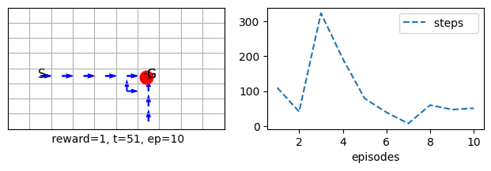
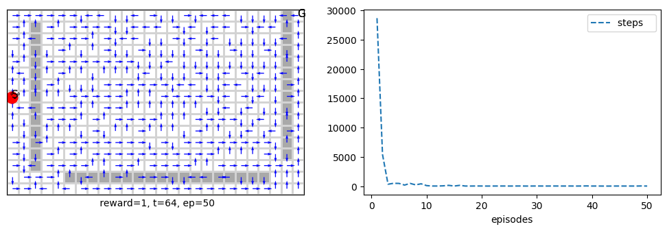
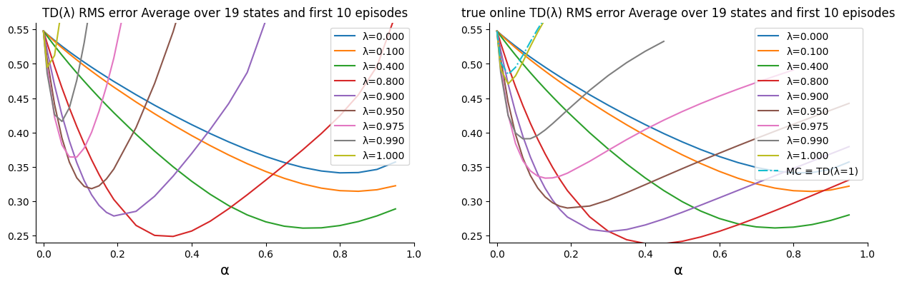
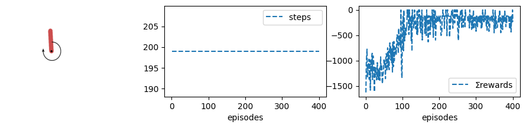
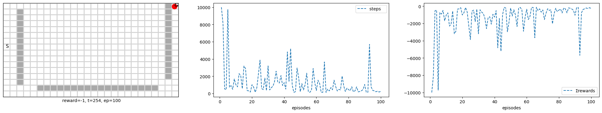
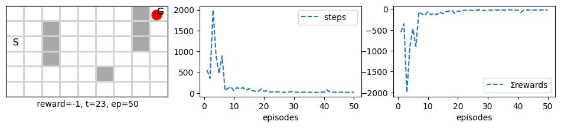

# rl_rob

**A from-scratch reinforcement learning library for learning how the algorithms actually work.**

`rl_rob` implements the full arc of modern RL, from tabular temporal-difference methods to deep policy-gradient control, using nothing but standard Python (`numpy`, `matplotlib`). No PyTorch black boxes, no framework indirection: every update rule is visible and every algorithm reduces to the same one-line call. It is built for insight first, and has been used to teach reinforcement learning to several hundred postgraduate students.

> Author: Abdulrahman Altahhan. The code is provided for teaching and study. Permission from the author is required for research, commercial, or other reuse (see [Licence](#licence)).

---

## Why rl_rob

- **One consistent API across every method.** Tabular, linear, and neural algorithms share the same declarative form, so moving from Q-learning to DQN is a one-word change, not a rewrite.
- **Readable from first principles.** Written from scratch in `numpy`/`matplotlib`, so you can read the actual update, not a framework wrapper around it.
- **A complete curriculum, not a grab-bag.** The algorithms follow the Sutton & Barto progression and ship with worked tutorials and learning outcomes.
- **Built-in experiment and plotting harness.** `.interact()` runs the agent and returns learning curves, value maps, and trajectory views with no extra plumbing.

---

## Quickstart

Every algorithm follows the same pattern: construct with an environment and hyperparameters, then call `.interact()`.

```python
from rl.tabular import *          # tabular algorithms + demos
from env.grid.tabular import *    # gridworlds, mazes, cliffwalk, ...

# Tabular Sarsa on a gridworld
sarsa = Sarsa(env=grid(), α=.8, episodes=50, seed=10).interact()
```

The same call shape scales all the way to deep RL:

```python
from rl.neural import *

# DQN with replay buffer + target network on a sparse-reward maze
dqn = DQN(env=imaze(reward='sparse'), α=1e-4, γ=.98, episodes=30,
          trunk=[(8, 4, 2), (4, 4, 4)],
          nbuffer=1000, nbatch=64, rndbatch=True).interact()
```

Switching algorithm is a single token: swap `DQN` for `DDQN`, `nnSarsa`, or `nnQlearn`, keep everything else.

---

## What's inside

| Stage | Module | Algorithms | Environments |
|-------|--------|-----------|--------------|
| Tabular | `rl.tabular`, `rl.rl` | TD(0), MC, Sarsa, Q-learning, n-step Sarsa, Dyna-Q, Prioritised Sweeping | random walk, gridworld, mazes, windy grid, cliffwalk |
| Linear approximation | `rl.linear` | MC control, Sarsa, Q-learning, n-step Sarsa, eligibility traces (TD(λ), Sarsa(λ)), REINFORCE, actor-critic | Mountain Car, Acrobot, Pendulum, CartPole (with tile coding & discretisation) |
| Neural / nonlinear | `rl.neural` | nnMCC, nnSarsa, nnQlearn, DQN, DDQN, nnTD(λ), nnSarsa(λ), REINFORCE, actor-critic, PPO | sparse-reward mazes and continuous control |

State representation utilities (`env.gym.discretised`, `env.gym.tiled`) provide additive discretisation and hashed multi-tiling tile coding out of the box.

---

## Results gallery

Every figure below is produced directly by `.interact()`; no extra plotting code.

**Tabular methods**

Sarsa learning to reach the goal on a gridworld (trajectory, then steps per episode):



Dyna-Q planning on a large maze: the learned policy (left) and how planning collapses steps-to-goal within a handful of episodes (right):



**Linear function approximation**

Eligibility traces: TD(λ) RMS error against the step size α for a range of λ, recovering the classic bias/variance trade-off (and true-online TD(λ) on the right):



Policy-gradient control on a continuous task: the return curve climbs as the policy improves:



**Neural function approximation**

Deep value-based control (DQN) on a sparse-reward maze over 100 episodes (steps and return per episode):



Neural policy-gradient control reaching the goal and stabilising its return:



*(All pulled straight from the worksheets; swap in your own preferred runs at any time.)*

---

## Examples

A few minimal, self-contained runs live in [`examples/`](examples/) so you can see the library working without any course material:

- `examples/sarsa_gridworld.py`: tabular Sarsa on a gridworld
- `examples/tilecoded_mountaincar.py`: linear control with tile coding
- `examples/dqn_maze.py`: deep value-based control on a sparse-reward maze

These are intentionally tiny. They are the library's own demos, separate from the teaching worksheets below.

## Tutorials (full curriculum)

A progressive set of Jupyter worksheets takes you from one-step TD to PPO, each with explicit learning outcomes. The worksheets live in the companion **RL Module** book (built with Jupyter Book) and install `rl_rob` as a dependency. They are linked here, not bundled into this repo, so the library stays standalone.

| # | Worksheet | Focus |
|---|-----------|-------|
| 3.1 | Temporal Difference Learning | bootstrapping, MC vs TD, Sarsa, Q-learning |
| 3.2 | n-step Bootstrapping | extending one-step to n-step, the bias/variance sweet spot |
| 3.4 | Planning and Learning | Dyna-Q, prioritised sweeping, model-based RL |
| 4.1 | Linear State-Value Prediction | features, encodings, tabular-to-approximation |
| 4.2 | Linear Action-Value Control | tile coding, additive vs multiplicative representations |
| 4.3 | Eligibility Traces (linear) | backward-view λ-return, TD(0)–MC interpolation |
| 4.4 | Policy Gradient (linear) | REINFORCE, actor-critic, softmax & Gaussian policies |
| 5.1 | Neural State-Value Prediction | trunk/neck networks, batching, under/overfitting |
| 5.2 | Neural Control | nnSarsa, nnQlearn, DQN, DDQN, experience replay |
| 5.3 | Neural Eligibility Traces | nnTD(λ), nnSarsa(λ), credit assignment |
| 5.4 | Neural Policy Gradient | REINFORCE, n-step actor-critic, GAE, PPO |

> Replace the worksheet names with links to the published book pages once the RL Module site is live. Keep the dependency one-way: the book installs `rl_rob`, never the reverse.

---

## Installation

```bash
git clone <your-repo-url> rl_rob
cd rl_rob
pip install -r requirements.txt   # numpy, matplotlib, gymnasium, ...
```

Then from a notebook or script:

```python
%cd ~/rl_rob
from rl.tabular import *
```

---

## Licence

This library is shared for teaching and personal study. Use for research, commercial, or other purposes requires the author's permission. Please contact the author before redistributing or building on the code.
